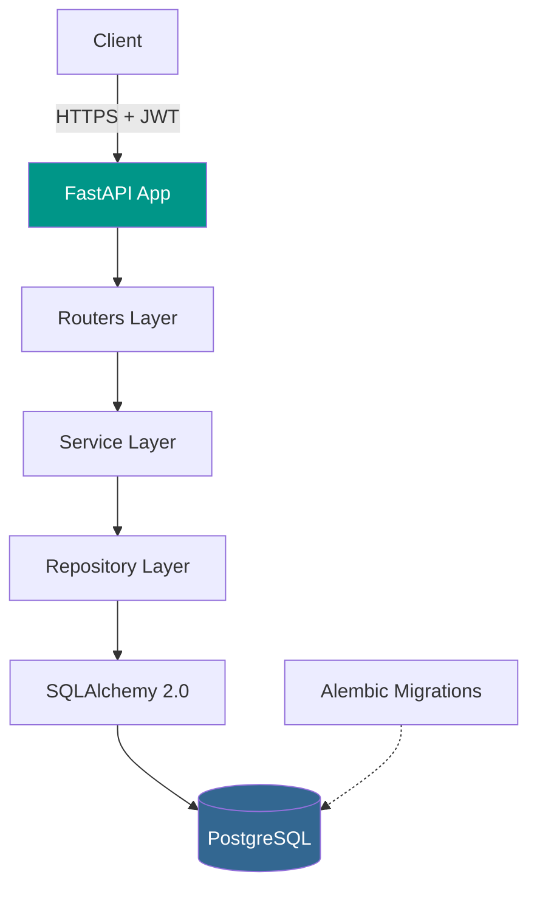

<div align="center">

# Store-Inventory-API

**Production-grade REST API for inventory management — FastAPI + SQLAlchemy 2.0 + PostgreSQL + JWT.**

[](LICENSE)
[](https://www.python.org/)
[](https://fastapi.tiangolo.com/)
[](https://www.postgresql.org/)
[](https://www.docker.com/)
[](https://github.com/franamaro-dev/Store-Inventory-API/actions)

</div>

---

## What it solves

A reference implementation of an enterprise-grade backend that recruiters and tech leads can actually clone and run in 60 seconds.

It demonstrates the patterns I use in production work: **layered architecture**, **migrations as code**, **typed ORM**, **JWT auth with role separation**, and a **Dockerized dev environment** that mirrors prod.

---

## Architecture



---

## Features

- **JWT authentication** with access / refresh tokens and role-based access control
- **SQLAlchemy 2.0** typed ORM (no legacy `Query` API)
- **Alembic** migrations checked into the repo, autogenerated and reviewed
- **Pydantic v2** schemas for request / response validation
- **Async** request handlers (`async def`)
- **Dependency injection** for DB session, current user, settings
- **Layered architecture**: routers → services → repositories → models
- **Docker Compose** for full local stack (api + db) in one command
- **OpenAPI / Swagger** auto-docs at `/docs`

---

## Quickstart

```bash
git clone https://github.com/franamaro-dev/Store-Inventory-API.git
cd Store-Inventory-API
cp .env.example .env
docker compose up --build
```

API at http://localhost:8000/docs

### Apply migrations

```bash
docker compose exec api alembic upgrade head
```

### Run tests

```bash
docker compose exec api pytest -v
```

---

## Tech stack

| Concern | Tool |
|---------|------|
| Framework | FastAPI |
| ORM | SQLAlchemy 2.0 (typed) |
| Migrations | Alembic |
| Validation | Pydantic v2 |
| Auth | python-jose (JWT), passlib (bcrypt) |
| Database | PostgreSQL 16 |
| Container | Docker + docker-compose |
| Testing | pytest, httpx, pytest-asyncio |

---

## Project structure

```
.
├── app/
│   ├── api/           # routers (FastAPI endpoints)
│   ├── core/          # config, security, dependencies
│   ├── models/        # SQLAlchemy models
│   ├── schemas/       # Pydantic schemas
│   ├── services/      # business logic
│   └── main.py        # app factory
├── alembic/           # migrations
├── tests/
├── docker-compose.yml
├── Dockerfile
└── requirements.txt
```

---

## Roadmap

- [ ] Role-based field-level permissions
- [ ] Soft-delete with audit log
- [ ] Background jobs (Celery + Redis)
- [ ] Prometheus metrics endpoint
- [ ] OpenTelemetry tracing

---

## License

[MIT](LICENSE) © Francisco Amaro Prieto

---

<div align="center">

Built by [Francisco Amaro](https://github.com/franamaro-dev) — Backend Engineer & SOC L1 Analyst
[LinkedIn](https://linkedin.com/in/franamaro) · [Email](mailto:franamaroprieto@gmail.com)

</div>
